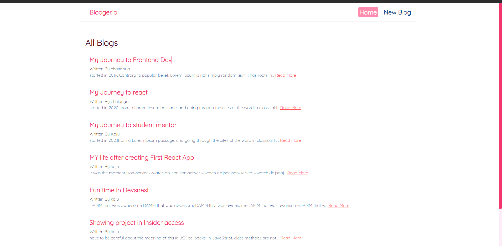
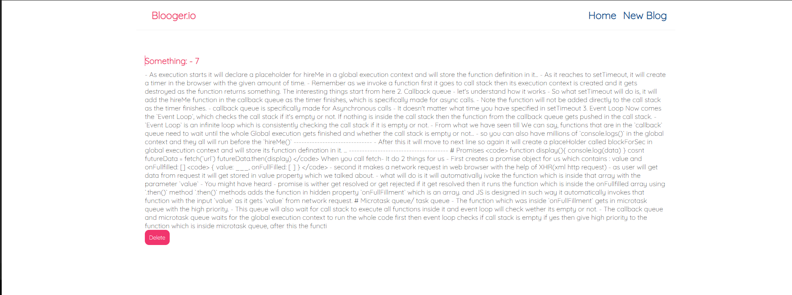
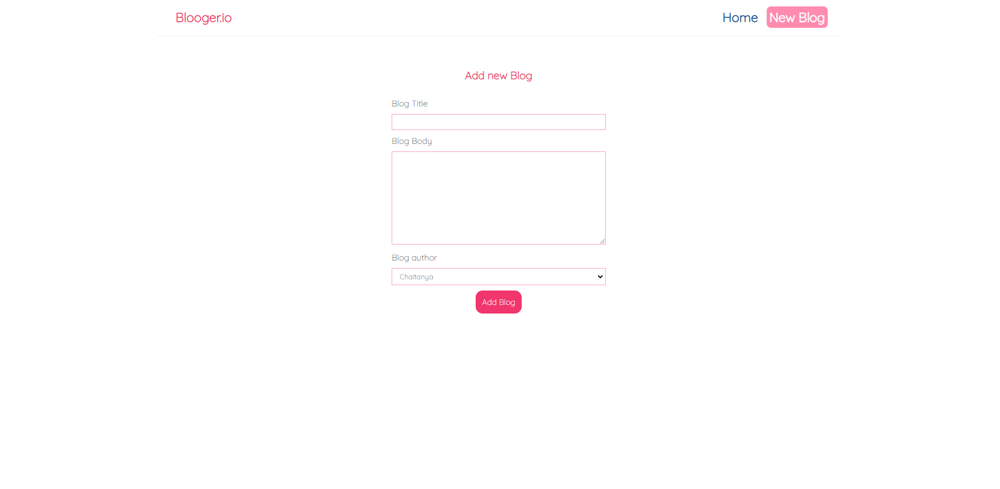
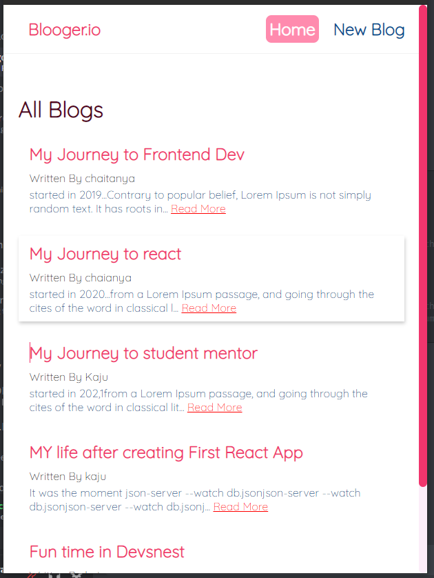

# Blooging.io

## 👨🏻‍💻👩🏻‍💻 Introduction

 <strong> Blooging site To feature your own blog post in simple way </strong>

 

<strong> ™Blooging.io </strong>

    

 

## 🧠 About Project

A free developer blogging platform that allows you to publish articles on your own domain and helps you stay connected with a global developer .

 

If someone wants to save their blog post in such manner that he can read it after sometime or anyone can see it then this is the right platform for that person

<h1 align="center">Site Preview 🏷 </h1>

<strong ><code>Landing Page</code></strong>

 

<strong>When user clicks on that specific blog</strong>

 

<strong>When User wants to create new Blog</strong>

 

<strong>Responsive and Custom scroll Bar</strong>

 
 

## 📌 TechStack

<ul>
    <li>Html</li>
    <li>CSS </li>
    <li>Javascript </li>
    <li>React </li>
    <li>Node.js </li>
    <li>json-seerver </li>
</ul>

 
 

## Contributors 🌟

Thanks goes to these wonderful people ✨✨:

 
 
 

>React Docs

## Css
- Adding external css file `import "./App.css"`
- Inline css `style={{ color: "red", backgroundColor: "pink" }}`

## Hooks
> useState: react need to render the component to show the change, so to this we have useState Hook

`const [name, setName] = useState("jaduu")`

## Devtools
- You can see state change in components
- chagne values of state in devtools it will get updated on screen.

## Props
- Pass some values from parent to child, You can not pass something from child to parent
- passing blogs from parrent to child

## Filter
- `filter()` if the id we pass it didnt match to the given id then the value which is returning will get stored in new variable

   

      <BlogList
        data={data.filter((blog) => blog.author === "chaitanya")}
        title="Chaitanya's Blogs"
      />
      

      <BlogList
        data={data.filter((blog) => blog.author === "Kaju")}
        title="Kaju's Blogs"
      />
       <button onClick={handleChange}>Change name: {name}</button> 

- <code> let newArr = array.filter((el) => el !== 4) </code>

## UseEffect
- This function runs when something is updated
- We pass empty [] as 2nd parameter to run this function only once

## Json server
- `npx json-server --watch data/data.json --port 8000`
When we invoke a function it gets pushed in the call stack.

## Fetch
- fetch will take some time to give us data, so we are adding `&&` to check wether data is there or not.

- ` { blogs && <BlogsList /> } ` If blogs are true only then it will move to right hand side code.

## Loading
- If data is not render yet then shoe render
- { loading && 
Loading... 
 }

## try and catch
- added error handling in fetchdata  function .
- used `throw` keyword to give error when `res.ok` is false
- displayed this error on screen using `{ error && 
{error}
 }`

## Custom Hook
- lets asume we want to use that fetch and useEffect in another component,
so we cant just do that we need to rewrite the whole thing again..
- To avoid this we have custom hooks
- These hooks start from useFetch.
- we removed all data from Home.jsx (async function and all useStates)
- added them in useFetch.jsx
- changing blogs => data, coz if wer're using this hook some other place then we dont want the state to have blogs variable
- now to use the state from useFetch in another component we need to return it first.
- `return { data, error, loading } `

## Routing

- First you need to wrap your whole component with `Router`
-  `Switch` This chesks if the given route matches any route or not, if yes then it will give us first matching route from the switch
- `Route` - render the given component on given path.
- Now when you click on links it is sending a fresh request to server again, coz we used a`href` there
- To avoid this we have `<Link>` tag in `react-router`

## Clenup in useEffect
- If we change the route before data is fetched then we getr error

- we just need to return a callback function after data is fetched
<code> return () => console.log(`ckeared`)</code>

- We have one property to this called abortController

- const abortCont = new AbortController()

- `{ signal: abortCont.signal }` add this thing as second parameter in fetch function

- <code> return () => </code>

## Routing again
- Now if user clicks on any blog then that blog should open with that specific id

- To do this we have `useParams()` hook

- In app.jsx added `/:id` to have specific id in each route

- now when user goes to that spcfic blog again we need to fetch data with his blog.id... now we will reuse our `useFetch()` hook

